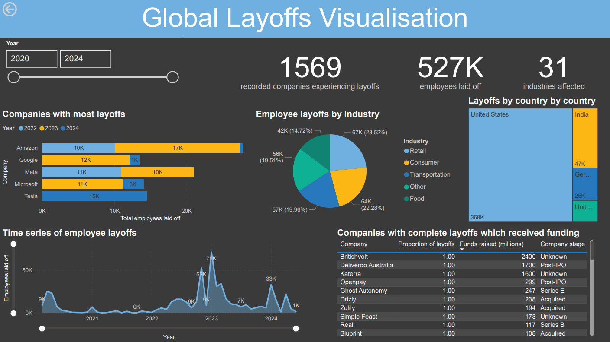

# Global Layoffs Analysis (2020-2024)

This project analyses global employee layoffs from 2020 to 2024, showcasing advanced SQL skills for data cleaning and exploration, complemented by Power BI visualisations for insights. The dataset includes over 1,500 companies across 31 industries, highlighting layoff trends by company, industry, geography, and time. The analysis contextualises layoff patterns within global economic events and demonstrates technical proficiency in data analytics.

---

## Table of Contents
- [Technical Workflow](#technical-workflow)
  - [Data Cleaning](#data-cleaning)
  - [Exploratory Data Analysis (EDA)](#exploratory-data-analysis-eda)
  - [Visualisations](#visualisations)
- [Key Findings](#key-findings)
- [Original Dataset](#original-dataset)

---

## Technical Workflow


### Data Cleaning
SQL was used to clean the raw dataset. 

My approach to data cleaning follows the steps of: 


- **Removed Duplicates**:

  Columns were counted, and duplicates after the first are identified with the *row_num > 1* and removed.

  ```sql
  DELETE
  FROM layoffs_staging2
  WHERE row_num > 1;

- **Standardised Columns** (e.g., ensuring industries, countries, etc are consistent)

  Values in columns were standardised. For example, different companies had various versions of 'crypto', 'cryptocurrencies' as their business type. This was done by using the *%* command after *crypto* to identify any     variations in spelling, and where then updated.

  ```sql
  UPDATE layoffs_staging2
  SET industry = 'Crypto'
  WHERE industry LIKE 'Crypto%';

  Likewise, some countries had full-stops in their string. These were also identified and updated.

  ```sql  
  UPDATE layoffs_staging2
  SET country = TRIM(TRAILING '.' FROM country)
  WHERE country LIKE 'United States%';

- **Handled null values**
  
  I used a self-join on t1 with the company, and t2 on the industry. Where *both* industry and company where null, they were removed as these rows would not be able to contribute to any meaningful EDA.

  ```sql
  UPDATE layoffs_staging2 t1
  JOIN layoffs_staging2 t2
  ON t1.company = t2.company
  SET t1.industry = t2.industry
  WHERE t1.industry IS NULL;

---

## Exploratory Data Analysis (EDA)
SQL queries where used to perform the EDA. I write the following queries aiming to identify layoff trends by year, company and industry, and geography. I also wanted to determine which companies recieved relief funding, and also recorded 100% layoffs:

- **Temporal Trends**
  ```sql
  SELECT YEAR(`date`) AS Year, SUM(total_laid_off) AS Total_Laid_Off
  FROM layoffs_staging2
  GROUP BY Year
  ORDER BY Total_Laid_Off DESC;
  
Layoffs peaked in 2022-2023 (Appendix 1), possibly driven by overhiring during the pandemic and subsequent economic corrections.

Lower layoffs in 2020-2021 were possibly due to pandemic relief efforts, while the dip in layoffs in 2024 may have reflected market stabilisation.

| YEAR(`date`) | SUM(total_laid_off) |
|--------------|---------------------|
| 2023         | 212585             |
| 2022         | 150707             |
| 2024         | 77194              |
| 2020         | 70755              |
| 2021         | 15810              |


- **Industry and Company Insights**
  ```sql
    SELECT company, SUM(total_laid_off) AS Total_Laid_Off
    FROM layoffs_staging2
    GROUP BY company
    ORDER BY Total_Laid_Off DESC;

Retail and technology led layoffs, with Amazon and Meta among the top contributors.

| industry       | SUM(total_laid_off) |
|----------------|---------------------|
| Retail         | 67368              |
| Consumer       | 63814              |
| Transportation | 57163              |
| Other          | 55864              |
| ...            | ...                |
| Unknown        | 35                 |


- **Geographic Trends**
    ```sql
    SELECT country, SUM(total_laid_off) AS Total_Laid_Off
    FROM layoffs_staging2
    GROUP BY country
    ORDER BY Total_Laid_Off DESC;

The United States and India experienced the largest layoffs, primarily in tech hubs.

| country              | SUM(total_laid_off) |
|----------------------|---------------------|
| United States        | 367630             |
| India                | 47127              |
| Germany              | 25345              |
| United Kingdom       | 16733              |
| ...                  | ...                |
| Ukraine              | 50                 |


- **Funding and Layoffs**
    ```sql
    SELECT company, location, percentage_laid_off, funds_raised_millions
    FROM layoffs_staging2
    WHERE percentage_laid_off = 1
    ORDER BY funds_raised_millions DESC;
  
Several companies (e.g. Britishvolt and Deliveroo Australia) underwent complete layoffs despite significant funding.

| Company               | Location       | Percentage Laid Off | Funds Raised (Millions) |
|-----------------------|----------------|---------------------|--------------------------|
| Britishvolt           | London         | 1                   | 2400                     |
| Deliveroo Australia   | Melbourne      | 1                   | 1700                     |
| Katerra               | SF Bay Area    | 1                   | 1600                     |
| Convoy                | Seattle        | 1                   | 1100                     |
| ...                   | ...            | ...                 | ...                      |
| Atsu                  | Seattle        | 1                   | 1                        |


- **Monthly Rolling Totals**
    ```sql
    WITH Rolling_Total AS (
      SELECT SUBSTRING(`date`, 1, 7) AS Month, SUM(total_laid_off) AS Total_Laid_Off
      FROM layoffs_staging2
      GROUP BY Month
    )
    SELECT Month, Total_Laid_Off,
    SUM(Total_Laid_Off) OVER(ORDER BY Month) AS Rolling_Total
    FROM Rolling_Total;

Rolling totals provided a cumulative view of layoffs, highlighting key inflection points.

| Month   | Total Off | Rolling Total |
|---------|-----------|---------------|
| 2020-03 | 8981      | 8981          |
| 2020-04 | 25271     | 34252         |
| 2020-05 | 22699     | 56951         |
| ...     | ...       | ...           |
| 2024-06 | 1410      | 527051        |

*The data for the above findings can also be found in the .csv files stored under assets/eda.*

---

## Visualisations

To provide greater clarity on the EDA results above, I used PowerBI to create a dashboard.

The cleaned dataset and dashboard are available to download in this repository.



---

## Key Findings

The takeaway points from this EDA and PowerBI visualisation are summarised as:

**1. Temporal Trends:**
Layoffs spiked in 2022-2023 due to overhiring during the pandemic and subsequent economic corrections.
Layoffs were minimal in 2020-2021 due to pandemic relief efforts and market uncertainty, with recovery seen in 2024.

**2. Industry Impact:**
Retail and Technology were the most affected industries, with overexpansion during the pandemic leading to significant corrections.

**3. Geographic Insights:**
The United States and India were the most impacted countries, especially in tech sectors.

**4. Funding Patterns:**
Several companies with substantial funding underwent complete layoffs, reflecting poor financial planning.

## Original dataset
Lee, R. (2022) Layoffs Data 2022. Available at: https://www.kaggle.com/datasets/theakhilb/layoffs-data-2022 (Accessed: 21st Dec 2024).

